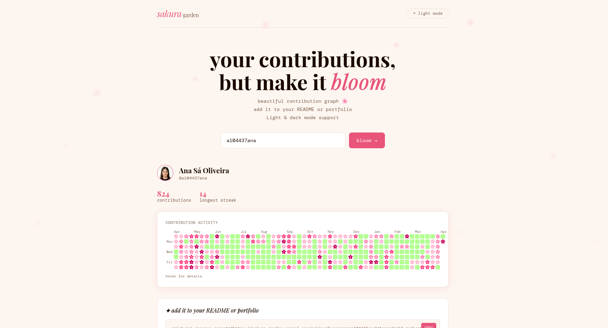
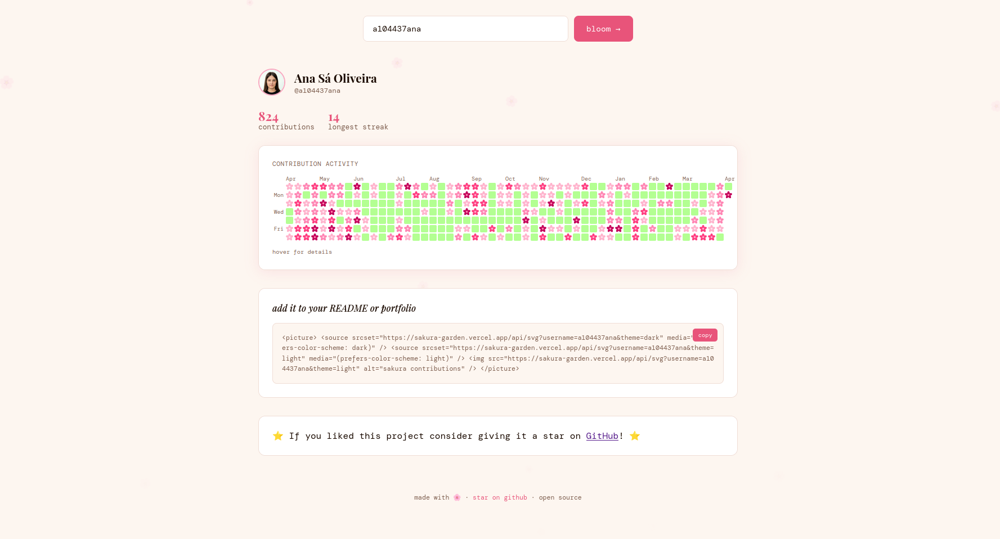

# 🌸 sakura garden
## A GitHub contributions garden for your README or portfolio

Turn your GitHub activity into a visual garden where commits bloom as flowers 🌸 and empty days stay green 🌿

Perfect for your README or portfolio to showcase your GitHub contributions in a unique and beautiful way!

Look at my garden! 👇

<picture>
  <source srcset="https://sakura-garden.vercel.app/api/svg?username=a104437ana&theme=dark" media="(prefers-color-scheme: dark)" width="1000"/>
  <source srcset="https://sakura-garden.vercel.app/api/svg?username=a104437ana&theme=light" media="(prefers-color-scheme: light)" width="1000"/>
  
</picture>

This garden works in both light and dark themes, so it will always look great no matter where you display it.

If you like this project, consider giving it a star ⭐

## Add to your README or portfolio

To add this garden to your README or portfolio, simply include the following image tag, replacing `your-github-username` with your actual GitHub username:

```markdown
<picture>
  <source srcset="https://sakura-garden.vercel.app/api/svg?username=your-github-username&theme=dark" media="(prefers-color-scheme: dark)" width="1000"/>
  <source srcset="https://sakura-garden.vercel.app/api/svg?username=your-github-username&theme=light" media="(prefers-color-scheme: light)" width="1000"/>
  
</picture>
```
This will display your GitHub contributions as a beautiful sakura garden in both light and dark themes.

Another option is going to <a href="https://sakura-garden.vercel.app" target="_blank">https://sakura-garden.vercel.app</a>, entering your GitHub username, and copying the generated image tag directly from the page.

[](https://sakura-garden.vercel.app)

[](https://sakura-garden.vercel.app)